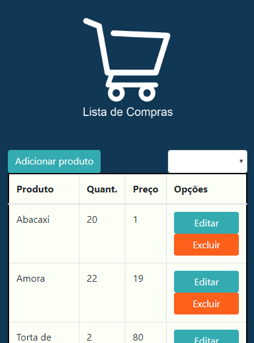
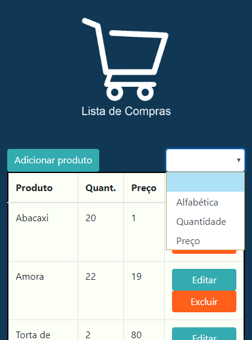
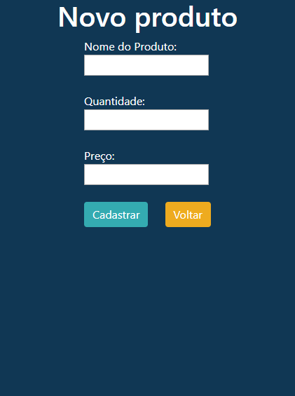
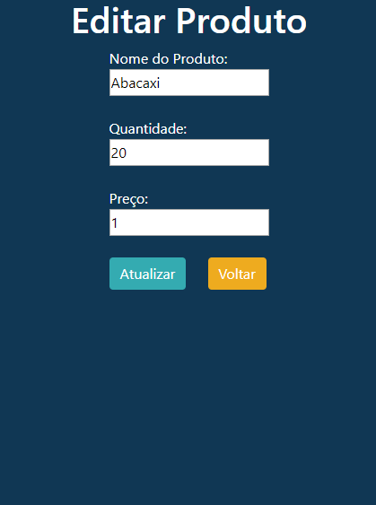

# Lista mercado

[Link website](https://listamercado-teste.000webhostapp.com/)(With DataBase remote)

- Training PHP and DataBase
- This website is responsive 
```diff
- This website are saving all the things in one
```
- This code are using DataBase not remote
---
## Images
- <h2>Width: 425px</h2>
<div style="display: flex; justify-content: center">
 
 
 
 
</div>-
 


---
## Contributors

- Raphael S. G. de Andrade <raphaelsatomiandrade@gmail.com>


